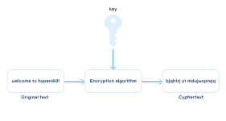

# Encryption - Decryption (Kotlin)

## Description
A command line tool in Kotlin to help you encrypt/decrypt messages or files using a simple shifting algorithm.  
The encryption is controlled by a key, a special parameter that controls the behavior of the encryption algorithm. 

### Encryption process in the Encryption-Decryption program

The key is assumed to mean that if a person knows the value of the key, they will be able to decrypt the text, and if they do not know it, they will not be able to decrypt the text. It's like a real key that can open up access to the message text.

## Objectives

1. Work with command-line arguments instead of the standard input.
2. The ability to read and write the original and cipher data into files.
3. When starting the program, the necessary algorithm should be specified by an argument.

### Command line arguments:
The program parse these arguments from the command line: 
* -mode: determine the program's mode (enc for encryption, dec for decryption).
* -key: is an integer key to modify the message.
* -data: is a text or ciphertext to encrypt/decrypt.
* -in: specifies the full name of a file to read the data.
* -out: specifies the full name of a file to write the result.
* -alg: specifies the algorithm to use in encryption/decryption. 

The order of the arguments might be different. For example, -mode enc maybe at the end, at the beginning, or in the middle of the array.

### Default values
- If there is no -mode, the program works in the enc mode;
- If there is no -key, the program considers that it is 0;
- If there is no -data and no -in arguments, the program assumes that the data is an empty string;
- If there are both -data and -in arguments, the program prefers -data over -in.
- If there is no -out argument, the program prints data to the standard output;
- If there is no -alg argument, the default algorithm is the `shift` algorithm.

### Algorithms
- In case of `shift`, only English letters are encoded — from "a" to "z" and from "A" to "Z". In other words, after "z" comes "a", after "Z" comes "A".
- In case of `unicode`, all non-letter characters are encrypted with the key as well as regular letters. There is no wrapping.

## Examples

### Example 1
encryption with the unicode algorithm
#### Arguments:
-mode enc -key 5 -data "Welcome to hyperskill!" -alg unicode

#### Output:
`\jqhtrj%yt%m~ujwxpnqq&`

### Example 2
decryption with the unicode algorithm
#### Arguments:
-key 5 -alg unicode -data "\jqhtrj%yt%m~ujwxpnqq&" -mode dec

#### Output:
`Welcome to hyperskill!`

### Example 3
encryption with the shift algorithm
#### Arguments:
-key 5 -alg shift -data "Welcome to hyperskill!" -mode enc

#### Output:
`Bjqhtrj yt mdujwxpnqq!`

### Example 4
decryption with the shift algorithm
#### Arguments:
-key 5 -alg shift -data "Bjqhtrj yt mdujwxpnqq!" -mode dec

#### Output:
Welcome to hyperskill!